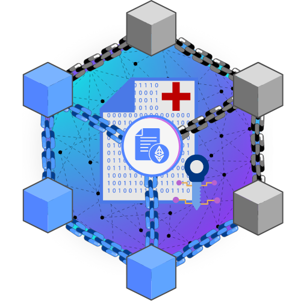

# EHR data management system

<!-- Project Intro -->
<div align="center">
  

  <h3 align="center">A <span style="color:#197ae0;">decentralized</span> EHR data management system</h3>

  <p align="center">
    A decentralized application (dApp) that runs it's backend on a decentralized server, i.e. <a href="https://ethereum.org/en/">Ethereum blockchain</a>.
    <br />
    <span >Patients can use the application to manage sharing and access control of their medical records with respective doctors registered on application<span>
    <br />
    <a href="https://github.com/Vedant2254/Fundme-hardhat-blockchain"><strong>Explore the source code »</strong></a>
    <br />
    <br />
    <a href="https://ehr-data-management-system.vercel.app/" target="_blank">Live dapp</a>
    ·
    <a href="https://github.com/Vedant2254/Fundme-hardhat-blockchain/issues">Report Issue</a>
  </p>
</div>

<!-- Table of Contents -->
<details>
  <summary>Table of Contents</summary>
  <ol>
    <li><a href="#about">About</a></li>
    <!-- purpose, current problem, potential solution, how project implements solution -->
    <li><a href="#technologies-used">Technologies used</a></li>
    <!-- Technologies from minor to major technologies -->
    <li><a href="#basic-terminologies">Basic terminologies</a></li>
    <!-- Basic terminologies like blockchain, ipfs, cryptography, hybrid encryption, etc. -->
    <!-- <li><a href="#how-to-install-the-project">How to install the project</a></li> -->
    <!-- How others can install the run the project locally -->
    <li><a href="#how-to-use-the-project">How to use the project</a></li>
    <!-- How to use the project, locally installed or deployed -->
    <li><a href="#technical-details">Technical details</a></li>
    <!-- Technical details like data structure, folder structure, mechanisms, etc. -->
    <li><a href="#acknowledgements">Acknowledgements</a></li>
    <!-- Every source that helped me solve problems that occured during development -->
    <li><a href="#future-scop">Future Scope</a></li>
    <!-- actions that can be taken to make application more usable and featured -->
  </ol>
</details>

## About

The project provides a secure and decentralized application designed to store and manage electronic health records (EHRs). Leveraging the power of the Ethereum blockchain, smart contracts, Interplanetary File System (IPFS) and hybrid encryption, the application provides patients with complete control over their medical data, while ensuring that their records remain secure and private.

With the application, patients can easily grant and revoke access to doctors as needed. Our decentralized access control system ensures that only the autorized parties can view and edit medical records, while also ensuring that patients maintain control over their own data.

### Advantage over traditional systems

While today's traditional EHR systems store data and manage access control through a centralized server in healthcare centers, users have to trust these organizations and their trust-based contracts for security of their data.

Our system takes a different approach. With our platform, both storage and access control is decentralized and transparent. The application executes in a trustless and verifiable environment powered by smart contracts on Ethereum blockchain where users can see the code of contract managing the access control and can view exactly how the data is stored on distributed IPFS network. In addition to distributed storage, the encryption and decryption of data is done using the user's own public and private key pairs so none other than user and his trusted parties can decrypt the data.

## Technologies Used

[![HTML][html]][html-url] [![Javascript][javascript]][javascript-url] [![NextJS][nextjs]][nextjs-url] [![Mantine][mantine]][mantine-url] [![Wagmi][wagmi]][wagmi-url] [![Metamask][metamask]][metamask-url] [![Ethereum][ethereum]][ethereum-url] [![Solidity][solidity]][solidity-url] [![Hardhat][hardhat]][hardhat-url] [![Ethers][ethers.js]][ethers-url]

## Basic Terminologies

### What is a blockchain and Ethereum blockchain?

**Blockchain** is a decentralized database that stores a record of transactions happening on blockchain in the form of blocks linked through their hashes. **Eheterum blockchain** can not only store transactions but also allows to execute the smart contract code deployed on blockchain.

### What are smart contracts?

Smart Contracts are self-executing programs stored on blockchain that automates the actions required in an agreement or contract. When deployed on blockchain these contracts possess a unique address just like EOA accounts, and can also have balance. Unlike EOA accounts contract addresses don't own a key pair, instead they contain a code that defines the logic abot how the contract will respond to an incoming call or transaction.

### What is IPFS?

IPFS stands for Interplanetary Filesystem. It is a distributed database where data is not stored on a single server, instead it is broken down into parts and is stored on multiple nodes in the network.

#### Storage and retrieval on IPFS

1. IPFS generates a unique hash for the data that is stored on IPFS. This hash is also called as CID (Content Identifier) which can be used to retrieve data from IPFS.
1. To retrieve data we can either directly use the IPFS protocol by typing `ipfs://<cid>`, or we can use a gateway like `https://ipfs.io/ipfs/<cid>`.

### What is encryption and decryption?

Cryptography of data involves two important processes, i.e. encryption and decryption.

**Encryption** is the process of converting the plain human-readable text into non-readable cipher text. The process uses a cryptographic key which is private to the autorized users. To recover the original data cryptographic key is required.

**Decryption** is the process of converting the non-readble cipher text back into readable plain text. This can be done only by autorized users who own the cryptographic key used during encryption of data.

<!-- ## How to install the project -->

## How to use the project

<!-- Prerequisites -->

### Essential Prerequisite: Metamask

MetaMask is a digital wallet that enables users to manage their Ethereum accounts and interact with Ethereum applications directly in their web browsers. With MetaMask, users can securely store and manage their private keys, send and receive Ether and other Ethereum-based tokens, and sign transactions.

**To install MetaMask:**

1. Go to [MetaMask](https://metamask.io) and click the "Download" button.
2. Choose your browser and install the MetaMask extension.
3. Follow the setup instructions, including creating a new wallet and recording your seed phrase (which is important to keep safe and private).
4. Once you've set up MetaMask, you should see a small orange fox icon in your browser toolbar.

**To use MetaMask with our project:**

1. Make sure you are done with metamask installation and wallet creation.
2. Open our [webapp (EHR data management system)](https://ehr-data-management-system.vercel.app/) and click on "Connect" button to the right of navigation bar.
3. A MetaMask popup should appear asking for permission to connect to our application. Click "Connect" to grant permission.
4. In case you have multiple wallets in MetaMask, select the one you intend to use with our application.
5. Once connected, you should see your wallet address partially displayed in the place of "Connect" button.

While MetaMask can seem intimidating at first, it's an essential tool for interacting with Ethereum-based applications like ours. With just a few simple steps, you can get up and running with MetaMask and start using our application.

<!-- Register as patient or doctor -->

### Register

1. Navigate to the index page of our application.
2. If you're not already registered as a patient or doctor, click the "Register" button.
3. You should be redirected to the registration page.
4. Choose whether you want to register as a patient or doctor by switching the tab above.
5. Fill in the required fields in the registration form -
   - **First step:** fill in your basic details.
   - **Second step:** add your medical certificates (for patient) or doctor's certificates (for doctor).
   - **Third step:** fill in your social account details.
6. Optionally, you can upload any relevant certificates or documents to support your registration.
7. Review your information and make sure it's accurate.
8. Click the "Submit" button to complete your registration.

#### Extra steps for doctor's registration

10. After the doctor completes their registration, admin will review the submitted details and approve the doctor. This is done to ensure the accuracy and legitimacy of the data provided by doctor.

11. Once the admin verifies the doctor's data, the doctor will have to confirm their registration by providing their public key, this can be done by clicking "Confirm Registration" button from [doctor dashboard](https://ehr-data-management-system.vercel.app/doctor/dashboard). Doctor's public key is required for encryption of their patient's data.

<!-- Patient  -->

### Patient Dashboard

If registered as a patient you can access all your functionalities on [patient dashboard](https://ehr-data-management-system.vercel.app/patient/dashboard), which can also be accessed from [main page](http://ehr-data-management-system.vercel.app/) of application, by clicking on the "Patient Dashboard" button on navigation bar.

- **View general details:** Patients can view their personal information such as their name, age, gender, and contact information from the patient dashboard.
- **View medical certificates:** Patients can view and manage their medical certificates from the dashboard. This may include certificates for vaccinations, medical procedures, and other health-related information.
- **Edit general details:** Patients can edit their personal information from the dashboard, such as their phone number or email address.
- **Edit medical certificates:** Patients can update or add new medical certificates as needed. This includes uploading scanned copies of physical documents and entering relevant details.
- **Grant access to doctors:** Patients can grant access to their medical data to specific doctors. This is done through a secure access control system that uses blockchain technology to ensure the privacy and security of patient data.
- **Revoke access from doctors:** Patients can revoke access to their data from doctor at any time, providing them with complete control over who can view their medical information.

<!-- Doctor -->

### Doctor Dashboard

If registered as a doctor you can access all your functionalities on [doctor dashboard](https://ehr-data-management-system.vercel.app/doctor/dashboard), which can also be accessed from [main page](http://ehr-data-management-system.vercel.app/) of application, by clicking on the "Doctor Dashboard" button on navigation bar.

- **View general details:** Doctors can view their personal information such as their name, age, gender, and contact information from the doctor dashboard.
- **View doctor certificates:** Doctors can view and manage their certificates from the dashboard. This includes certificates for medical licenses, medical education, and other related certificates.
- **Edit general details:** Doctors can edit their personal information from the dashboard, such as their phone number or email address.
- **Edit doctor certificates:** Doctors can update or add new certificates as needed. This includes uploading scanned copies of physical documents and entering relevant details.
- **View patients:** Doctors can view a list of their patients and access their medical records from the dashboard.
- **View and edit patient medical certificates:** Doctors can view and edit patient medical certificates as needed. This includes reviewing test results, updating treatment plans, and recording other medical notes.

## Technical Details

### Mechanisms

#### Encryption / Decryption mechanism

##### Steps

1. `File` object received from `<input type="file" />` can be converted to data url using `FileReader().readAsDataURL(File)`, which directly gives a data url that can be put in `<iframe />` tag to dusplay the data.

1. The output from `FileReader().readAsDataURL(File)` is encrypted using `utf-8` to `hex` encryption, which can then be decrypted using `hex` to `utf-8` decryption.

##### Type of encryption used

1. Let's say we have patient X, and doctors A, B, C, D and patient X wants to give access to doctors A, B, C only.

1. Asymmetric cryptography uses recievers public key to encrypt data and recievers private key to decrypt data, but using this way only one person at a time can access the data, i.e. either patient can access his own data or a doctor can access patient's data, which is not at all feasible.

1. So, here we are using **hybrid encryption**, it works like this -

   - We have a symmetric key S using which we encrypt the data.
   - Then, we encrypt key S using A's public key and send it to A
   - We encrypt key S using B's public key and send it to B
   - We encrypt key S using C's public key and send it to C
   - Now A, B, C can decrypt encrypted key S using their private keys, and decrypt data using decrypted key S
   - While, D can't use any of the encrypted key S sent to A, B, C to decrypt key S

   ```
   encrypt(data, S)

   encrypt(S, A_pubkey) send to A
   encrypt(S, B_pubkey) send to B
   encrypt(S, C_pubkey) send to C

   decrypt(S, A_privkey) A gets key S
   decrypt(S, B_privkey) B gets key S
   decrypt(S, C_privkey) C gets key S

   decrypt(data, S)
   ```

#### Structure of data

##### Patient general details

This data is encrypted

```
{
    name: ----
    address: ---
    phoneno: ---
    .
    .
    .
}
```

##### Patient key data

This data has encrypted keys, only individual keys are encrypted

```
{
    keys: {
        address1: encKeySForAddress1
        address2: encKeySForAddress2
        address3: encKeySForAddress3
        .
        .
        .
    },
    medicalRecordCID: ---
}
```

##### Patient medical records

This data is stored in encrypted format, only accessible (read / read-write permission decided by smart contract)
by addresses present in keys of [Patient key data](#patient-key-data). Data is encrypted.

```
{
    previousVersion: {
        hash: "",
        key: ""
    },
    data: {
        certificates: [
            {
                title: ---
                description: ---
                media (image, pdf, docx, video, etc.): ---
            },
            {
                title: ---
                description: ---
                media (image, pdf, docx, video, etc.): ---
            },
            .
            .
            .
        ],
        metadata: {
            lastUpdatedBy: "",
            lastUpdatedDate: "",
            version: ""
        }
    },
    digitalSignatureOfLastUpdater: ""
}
```

##### Doctor general details

This data is not encrypted

```
{
    name: ----
    address: ---
    phoneno: ---
    .
    .
    .
    certificates: [
        {
            title: ---
            description: ---
            media (image, pdf, docx, video, etc.): ---
        }
        {
            title: ---
            description: ---
            media (image, pdf, docx, video, etc.): ---
        }
        .
        .
        .
    ]
}
```

<!--
#### Issues that occured during development

##### Metamask default account for contract read

1. Metamask sends transactions that needs to be signed through the account that is currently selected
2. But, when calling a view function on contract it may be sent through any account that is connected, not necessarily through the selected account
3. It was realised when patients data was returned instead call reverted with message "Not Allowed" as contract used to compare allowed addresses with msg.sender, when I returned msg.sender from contract I realised that the account call was being sent was not the account currectly selected in metamask, it was being sent from the account that was first connected to website.
4. In this application specifically for functions that are view functions and rely on msg.sender, I have used ethersjs direclty instead of wagmi hooks.
   ```js
   async function getPatientDataManually() {
     try {
       const provider = new ethers.providers.Web3Provider(window.ethereum);
       const signer = provider.getSigner();
       // useSigner() from wagmi can also be used to get current signer
       // const signer = useSigner();
       const contract = new ethers.Contract(contractAddress, abi, signer);
       console.log(await contract.getPtRecordHash(address));
     } catch (err) {
       console.log(err);
     }
   }
   ``` -->

### Backend `/backend`

#### Folder structure

- `contracts/` contains all smart contracts.
- `deploy/` contains deployment scripts.
- `deployments/` contains recent deployments on different networks, auto-managed by hardhat.
- `scripts/` contains the scripts to manually test smart contract or perform operations.
- `test/` contains tests to automate testing of smart contract.
- `hardhat.config.js` used to customize options of hardhat development environment.

#### Smart contracts

- `Contract.sol` - Main contract that stores and manages access control and permissions.
- `Roles.sol` - Provides data structure and functions for adding, and removing users.
- `AddressArrayUtils.sol` - Utility functions for Array of Addresses.
- `AddToBoolMapping.sol` - Provides an easily searchable custom mapping of Address to Boolean.
- `AddToStrMapping.sol` - Proveds an easily searchable custom mapping of Address to String.

#### Hardhat development environment

- **[Hardhat](https://hardhat.org/)** is an Ethereum development environment that provides a range of tools to help developers buld and deploy smart contracts more efficiently. It provides features like Test Automation, Gas Optimization, Network Management, and local hardhat network to make development easier.

- It comes with a config file `hardhat.config.js`, that helps customize the development environment, some of the options include -

  - `solidity` to specify the compiler version used to compile the contracts.
  - `defaultNetwork` to specify the default network on which scripts and tests are run.
  - `networks` option helps including multiple networks including local, testnets and mainnets.
  - `namedAccounts` allows naming the accounts which can be imported in tests and scripts using `getNamedAccounts()`.
  - `etherscan` and `gasReporter` are used for smart contract verification and gas reporting.

- All hardhat functionalities can be viewed by typing `yarn hardhat` in command line from the project folder, similarly `yarn hardhat <command>` can be typed to perform a specific hardhat operation. For example, for deploying a smart contract on sepolia network following command is used `yarn hardhat deploy --network sepolia`.

#### Upgradeable Contracts

The main contract is made upgradable using [OpenZeppelinTransaprentProxy]() pattern. This makes upgrading the contract possible without changning the address of contract and without losing the data of previous contract.

For making an upgradable contract using OpenZeppelinTransparentProxy pattern following contracts needs to be deployed -

- DefaultProxyAdmin contract
- ContractImplementation contract
- ContractProxy

#### Meta-transactions (Gas less transactions)

Using OpenZeppelin Defender Relayer, autotasks, EIP2771ContextUpgradeable.sol, MinimalForwarder.sol meta transactions are implemented.

`backend/autotasks/relay/index.js` is the autotask
`backend/build/relay/index.js` is the autotask built with all it's dependencies
`backend/scripts/defender/createAutotask.js` is used to create Autotask in defender
`backend/scripts/defender/createRelayer.js` is used to create Relayer in defender
`backend/scripts/defender/sign.js` is used to prepare a transaction
`backend/src/signer.js` is used to sign the transaction
`backend/scripts/defender/relay.js` is used to relay the transaction to relayer
`rollup` is the npm module that is used for building the autotask

### Frontend

#### Folder structure

- `utils/` contains all pure functions, these functions take some parameters, does some computation, and returns the result, depends on pre-built modules like `crypto`, `web3.storage`, `@metamask/eth-sig-util`.
- `hooks/` contains all communication functions (custom react hooks) used for communicating between frontend, backend and IPFS. These hooks use functions in `utils/`.
- `components/` contains all UI components and handles UI and user interaction. Built using [Mantine.dev](https://mantine.dev/) UI library, and depends on custom react hooks in `/frontend/hooks` to display dynamic data.
- `pages/` contains routes of application that users can visit. A single page combines one or more componets from `components/`.

#### Modules used

##### Files related

These help getting file from user, converting file to textual form, making it encryption compatible, finally storing it to IPFS.

1. `Blob` - converts object to array buffer, not quite used, but mentioned.

2. `File` - object of this type is returned from `<input type="file" />`

3. `FileReader` - it is used to read file as binary string, array buffer, etc.

   Using `FileReader` we can convert the `File` object recieved from `input` tag to desired format, like `data url`, `array buffer`, etc. This data can be then passed to encryption algorithm to encrypt and decrypt the data.

4. `Buffer` - `crypto.randomBytes()` returns this type of object, which is used to generate `key` and `iv` for asymmetric encryption. It can be converted to `base64` using `buffer.toString('base64')` where `buffer` is object of `Buffer`.

###### Some textual file formats in used in the project -

- `utf-8` string format
- `ArrayBuffer` array of uint8
- `base64` binary format
- `data url` base64 encoded with data url append at start
- `hex` Hexadecimal format

##### Cryptography

1. `crypto` - used for symmetric encryption of data.

2. `@metamask/eth-sig-util` - used for asymmetric encryption using public keys of users, decrypting using user's private key, signing data using user's private keys, verifying data integrity using user's public key.

##### IPFS interaction

1. `web3.storage` - is used to programmatically upload and retrieve data from IPFS network.

##### Contract interaction

1. `wagmi` - is used to interact with contract through metamask, read and write data to contract using contract functions.

## Acknowledgements

## Future Scope

- We can store [w3name](https://github.com/web3-storage/w3name) instead of hash. Updates doesn't change this name, so reduces gas consumption of changing hash each time data gets changed.
- Contract administration and security can be made more robust by including [OpenZeppelin](https://www.openzeppelin.com/) services to administer smart contracts. Using OpenZeppelin and OpenZeppelin Defender, smart contract can be made upgradable and smart contract functions can also be automated as required.
- Unlike current system that charges users for making transactions, using OpenZeppelin Defender Meta-transactions, user will only have to sign the transaction while the gas fees required for the transaction can be fulfilled by a relayer. If we are running a profitable business out of this application, users can be freed of the transaction fees else a balance-like system can be introduced where user will be charged for all his transactions once in a specific duration, to fulfill the expenses of relayer.

<!-- Links -->

[html]: https://img.shields.io/badge/HTML5-E34F26?style=for-the-badge&logo=html5&logoColor=white
[html-url]: https://developer.mozilla.org/en-US/docs/Web/HTML
[bootstrap]: https://img.shields.io/badge/Bootstrap-563D7C?style=for-the-badge&logo=bootstrap&logoColor=white
[bootstrap-url]: https://getbootstrap.com/docs/5.0/getting-started/introduction/
[javascript]: https://img.shields.io/badge/JavaScript-F7DF1E?style=for-the-badge&logo=javascript&logoColor=black
[javascript-url]: https://www.javascript.com/
[ethereum]: https://img.shields.io/badge/Ethereum-3C3C3D?style=for-the-badge&logo=Ethereum&logoColor=white
[ethereum-url]: https://ethereum.org/en/
[chainlink]: https://img.shields.io/badge/chainlink-375BD2?style=for-the-badge&logo=chainlink&logoColor=white
[chainlink-url]: https://chain.link/
[solidity]: https://img.shields.io/static/v1?label=&message=Solidity&color=dodgerblue&style=for-the-badge&logo=hardhat
[solidity-url]: https://docs.soliditylang.org/
[hardhat]: https://img.shields.io/static/v1?label=&message=Hardhat&color=yellow&style=for-the-badge&logo=hardhat
[hardhat-url]: https://hardhat.org/
[ethers.js]: https://img.shields.io/static/v1?label=&message=Ethers.js&color=royalblue&style=for-the-badge&logo=hardhat
[ethers-url]: https://docs.ethers.io/v5/
[wagmi]: https://img.shields.io/static/v1?label=&message=Wagmi&color=black&style=for-the-badge&logo=wagmi
[wagmi-url]: https://wagmi.sh/
[nextjs]: https://img.shields.io/badge/Next-black?style=for-the-badge&logo=next.js&logoColor=white
[nextjs-url]: https://nextjs.org/
[mantine]: https://img.shields.io/static/v1?label=&message=Mantine&color=blue&style=for-the-badge&logo=mantine
[mantine-url]: https://mantine.dev/
[metamask]: https://img.shields.io/static/v1?label=&message=Metamask&color=orange&style=for-the-badge&logo=metamask
[metamask-url]: https://metamask.io/
